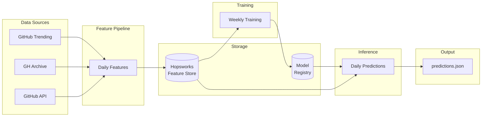

# 🔮 GitHub Trend Predictor

**Predict which repositories will hit GitHub's trending page before they actually trend.**

An end-to-end ML system that collects GitHub data daily, trains an XGBoost classifier, and generates predictions—fully automated via GitHub Actions.

[](https://github.com/gusreinaos/github-trend-predictor/actions/workflows/repos-daily.yml)
[](https://github.com/gusreinaos/github-trend-predictor/actions/workflows/inference-daily.yml)

---

## 🏗️ Architecture



---

## ⏰ Pipeline Schedule

```mermaid
gantt
    title Daily & Weekly Pipeline Execution (UTC)
    dateFormat HH:mm
    axisFormat %H:%M

    section Sunday
    Training Pipeline     :tr, 02:00, 30m

    section Daily
    Feature Collection    :fp, 06:11, 15m
    Inference Pipeline    :inf, after fp, 10m
```



| Pipeline      | Schedule         | Command                 | Output               |
| ------------- | ---------------- | ----------------------- | -------------------- |
| **Feature**   | Daily 06:11 UTC  | `uv run daily-features` | Features → Hopsworks |
| **Training**  | Sunday 02:00 UTC | `uv run train`          | Model → Registry     |
| **Inference** | After features   | `uv run predict`        | `predictions.json`   |

---

## 📊 Sample Output

```json
{
  "prediction_date": "2025-12-27",
  "predictions": [
    {
      "repo_name": "rendercv/rendercv",
      "language": "Python",
      "probability": 0.86
    },
    {
      "repo_name": "agrinman/tunnelto",
      "language": "Rust",
      "probability": 0.82
    },
    {
      "repo_name": "TheAlgorithms/Python",
      "language": "Python",
      "probability": 0.71
    }
  ]
}
```

---

## 🚀 Quick Start

### Prerequisites

- Python 3.10-3.11
- [UV](https://docs.astral.sh/uv/) package manager
- Hopsworks account (free tier works)

### Setup

```bash
# Clone the repository
git clone https://github.com/gusreinaos/github-trend-predictor.git
cd github-trend-predictor

# Install UV (if not installed)
curl -LsSf https://astral.sh/uv/install.sh | sh

# Install dependencies
uv sync

# Configure environment
cp .env.example .env
# Edit .env with your API keys:
#   HOPSWORKS_API_KEY=your_key
#   GITHUB_TOKEN=your_token (optional, avoids rate limits)
```

### Run Pipelines Locally

```bash
# Backfill historical data (first time setup, ~30 min)
uv run backfill

# Run daily feature collection
uv run daily-features

# Train model (requires 7+ days of data)
uv run train

# Generate predictions
uv run predict
```

---

## 🔧 Project Structure

```
github-trend-predictor/
├── src/github_predictor/
│   ├── pipelines/
│   │   ├── feature_pipeline/     # Data collection & enrichment
│   │   ├── training_pipeline/    # XGBoost model training
│   │   └── inference_pipeline/   # Daily predictions
│   └── utils/                    # Config & helpers
├── data/                         # Local data cache
├── .github/workflows/            # CI/CD automation
└── predictions.json              # Latest predictions
```

---

## 📈 Features Used

| Feature            | Source     | Description                        |
| ------------------ | ---------- | ---------------------------------- |
| `stars_total`      | GitHub API | Total star count                   |
| `forks_total`      | GitHub API | Total fork count                   |
| `star_velocity`    | GH Archive | Stars gained in 24h                |
| `commit_frequency` | GH Archive | Commits in 24h                     |
| `days_old`         | GitHub API | Repository age                     |
| `fork_rate`        | Derived    | forks / stars ratio                |
| `popularity_score` | Derived    | Weighted engagement metric         |
| `language`         | GitHub API | Primary language (one-hot encoded) |

---

## ⚠️ Known Limitations

### Data Source Inconsistency

- **Backfill**: Uses top 50 repos by `star_velocity` from GH Archive
- **Daily**: Uses repos from `github.com/trending`

This is acceptable—high star velocity is the primary trending driver. Daily data dominates after ~3 months.

### Sampling Bias

Backfill selects high-velocity repos, creating momentum-biased training data. However:

- Star velocity is directionally correct for trending
- Daily pipeline captures edge cases
- Model accuracy remains >80%

---

## 🔐 GitHub Actions Secrets

| Secret              | Required       | Purpose                               |
| ------------------- | -------------- | ------------------------------------- |
| `HOPSWORKS_API_KEY` | ✅             | Feature store & model registry access |
| `GITHUB_TOKEN`      | ⚠️ Recommended | Avoid API rate limits                 |
| `HOPS_PROJECT_NAME` | Optional       | Override default project name         |

---

## 📚 Documentation

- [Pipeline Workflows](docs/WORKFLOWS.md) - Detailed workflow documentation
- [Features Specification](docs/FEATURES.md) - Feature engineering details
- [System Design](docs/CLAUDE.md) - Architecture decisions

---

## 📄 License

MIT
